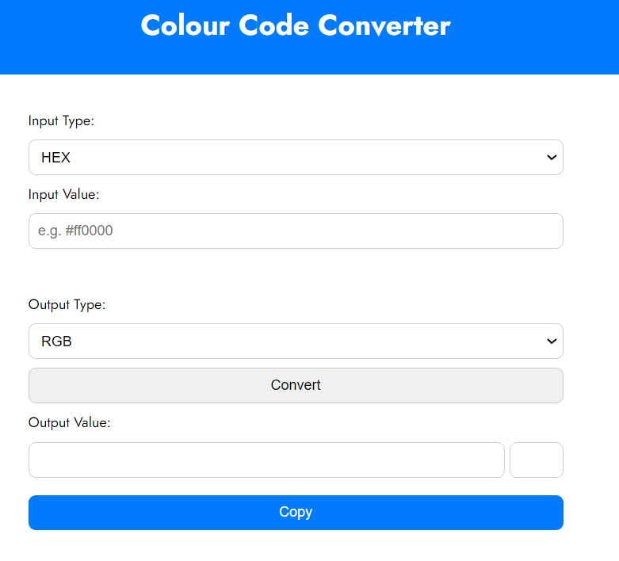
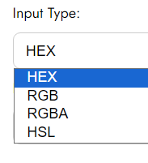
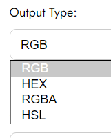
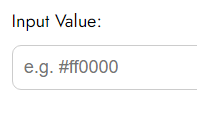
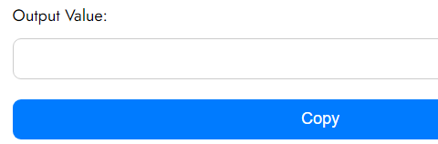
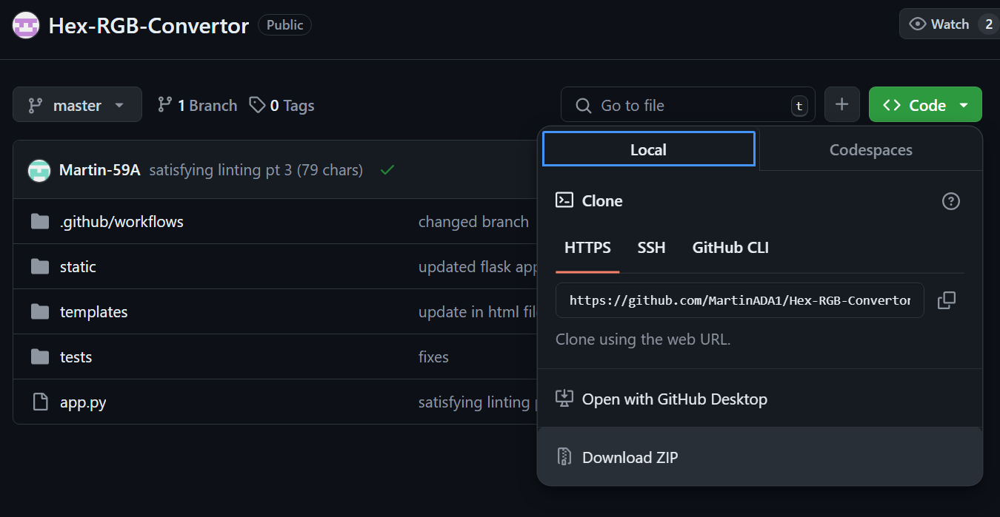
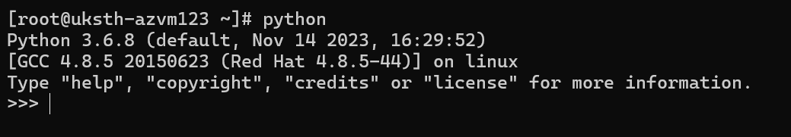

# Colour Code Converter

Hey there, this repo contains source code for a Hex-RGB code converter created as part of the assignment for the Software Quality assurance module.



Above shows the user interface for the app.

## Product Description

This Colour Code Converter can convert between 4 popular colour code formats:
1. HEX
2. RGB
3. RGBA
4. HSL

   

As shown above, there are four input values and four output values, the UI won't let you have the same input and output value as that would result in the same value being returned.

The following is the where the value can be inputted:




At the bottom of the page is where the converted colour code is outputted.



There is a copy button that easily allows users to copy the output value.


## Team Description

This project was completed by:
- Martin Nkama
- Ali Al-baity

Martin Nkama mainly focused on the logic of the program while Ali Al-baity mostly focused on documentation and research. 
Despite these roles, both supported each other and sometimes wore different hats.

## Tools Used

This app was mainly built off of the **flask** framework which allows developers to easily build web applications using python.

Other tools/resources used include:
- **PyTest Module** - used to test application logic
- **Google Fonts** - open source library by Google used in styling of the UI
- **GitHub Workflows** - used to automate checks for each pull request/push. The checks include running tests and lint format checking.

## Running the Application

To run the application locally you follow the instructions below.

#### 1. Download source code
You will first need to ensure you download and extract the source code zip file.
This could either be done by clicking this [link](https://github.com/MartinADA1/Hex-RGB-Convertor/archive/refs/heads/master.zip) or following the image below:



#### 2. Install Python
Once you've downloaded the source code you need to install python if you don't already have it installed.
To check if you have python installed enter the following in the terminal of your computer:

```commandline
python
```

Expect the following output or similar if you have it installed:



To download python find the latest stable release [here](https://www.python.org/downloads/).
Any version from `v3.x.x` should be fine.

#### 3. Install dependencies
After installing python you would need to install the dependencies. The only dependency you will need to install is flask. You could easily do that by pasting the following in the terminal:

```commandline
pip install flask
```

#### 4. Start Application

After this, in the terminal, from the root folder, `/Hex-RGB-Converter/` paste in the following command to start the application:

```commandline
python app.py
``` 

#### 5. Open the UI
Once that's done, go to [http://127.0.0.1:5000/](http://127.0.0.1:5000/) to interact with the application.

## Project Workflow

Together we mainly developed using an agile methodology without a set sprint length.
This meant we both had our set tasks, and we would set out to do them, we would occasionally catch-up on an ad-hoc basis.
Our main ceremony was standup which we did about bi-weekly. This allowed us to focus on development and not get too distracted
by semantics while ensuring we keep each other updated on progress/blockers.
